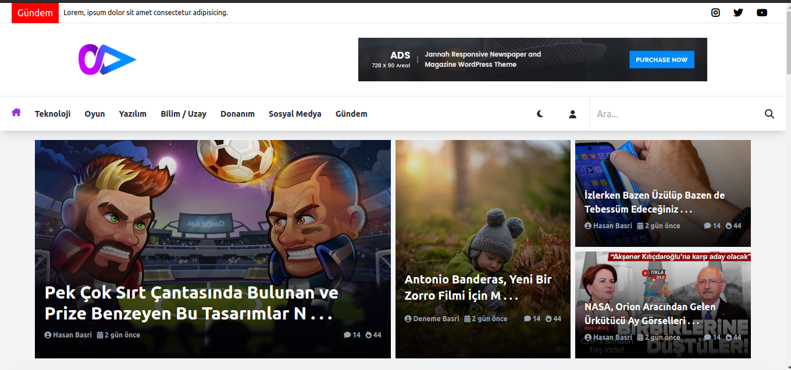
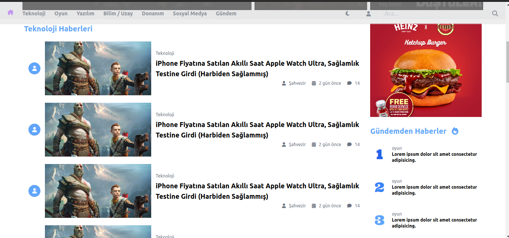
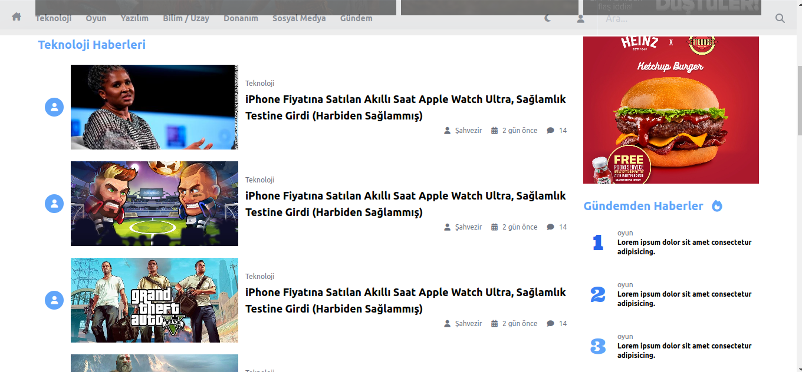
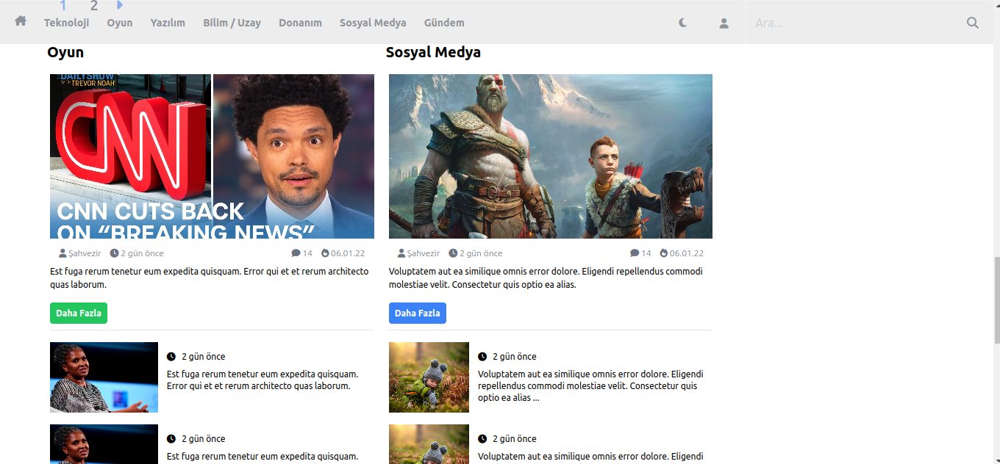
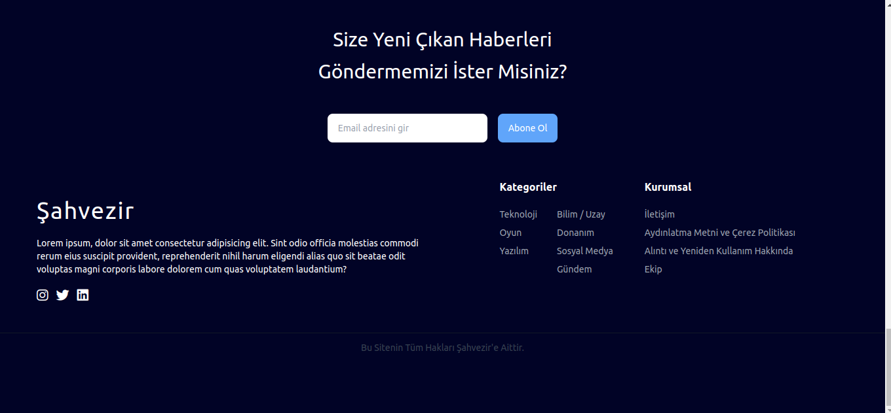
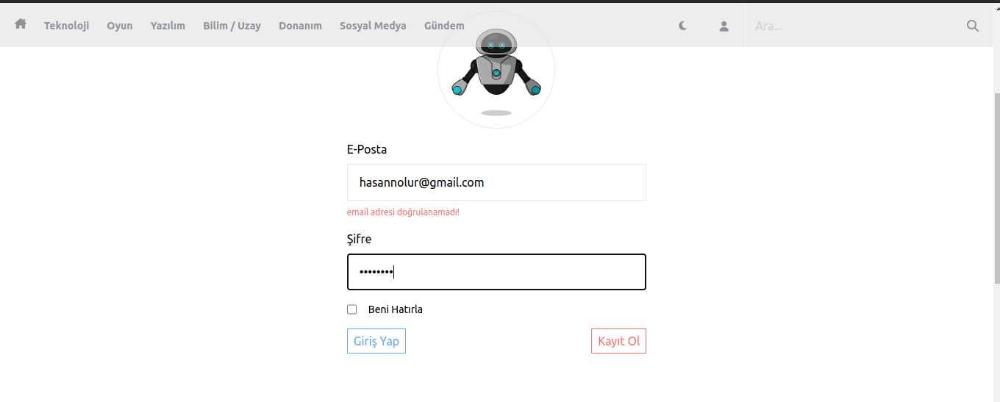
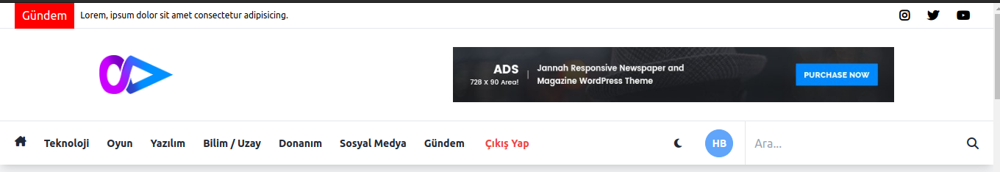

## Şahvezir Demo

Bu web sitesi laravel 9 sürümü ile yapılmıştır. Web Sitenin amacı haberleri düzgün bir şekilde paylaşması, ve unutmayın ki bu bir demo uygulamadır, karalı hali için çalışmalar sürmektedir

### Web Sitesinden Görseller
Sitenin tasarımı tamamen bana aittir. Herhangi bir front-end freamworkü kullanılmamıştır, sadece laravel blade, tailwindcss ve jquery ullanılmıştır.

Sistemimde bazı yerleşkeler henüz tamamlanmamıştır

## Sistemi daha iyi anlayabilmek için bir gif
### Anasayfa

## Kategori 

## Login İşlemi

Login işleminde ve tüm işlemlerde olduğu gibi laravel elequent mimarisini kurdum validate işleminden geçen bilgiler doğru ise kayıt olma/giriş işlemini tamamlıyor

Yukarıdaki resimde görüldüğü gibi girilen email hatalı olduğunu göstererek bilgi veriyor ve işlemi tamamlamıyor

Eğer işlem doğru ise navbarımız bu şekilde değişiyor